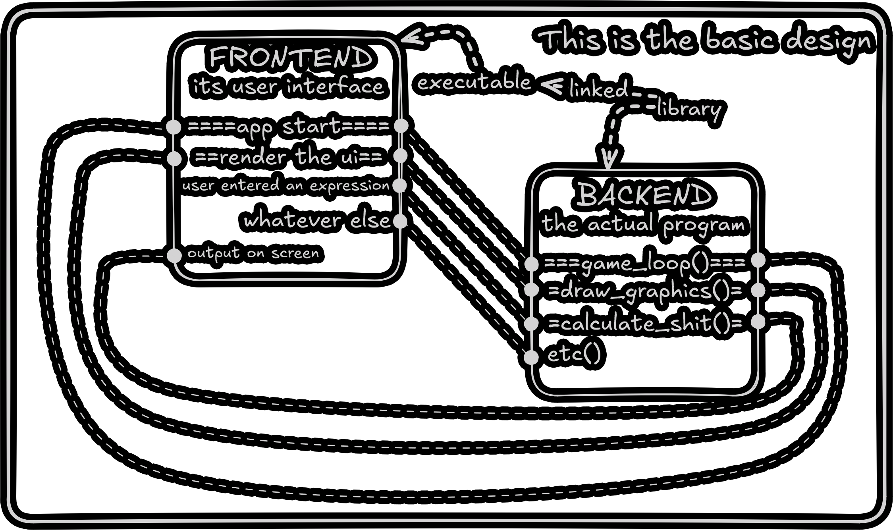
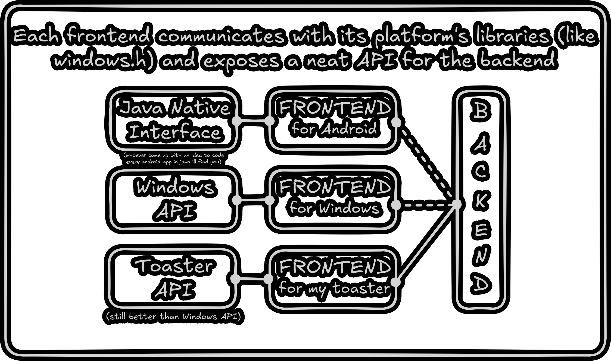

# Cross-Platform: The Test
###### (wow it feels really overexagerrated)

This application serves as an example of a really simple cross-platform C++ app (this one is a calculator).

# The Idea

|  |  |
|-|-| <!-- what idiot thought this is a good idea to implement tables in markdown -->
<!-- it just broke for no reason --> <!-- idk im too lazy to fix this TODO -->

# Compile instructions
## Prerequisites
1. [CMake](https://cmake.org)
2. A generator of your choice \([Make](https://www.gnu.org/software/make), [Ninja](https://ninja-build.org), MSBuild (comes with Visual Studio), etc.\)
3. A compiler of your choice \([gcc](https://gcc.gnu.org/), [CLang](https://clang.llvm.org/), MSVC (comes with Visual Studio), etc.\)

# FAQ
**Q:** I tried to CMake this repo, it only compiled a library. WTF??  
**A:** Read the compile instructions.
